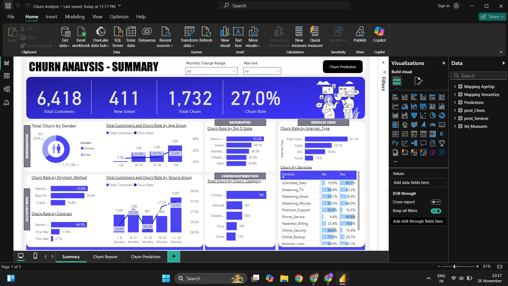
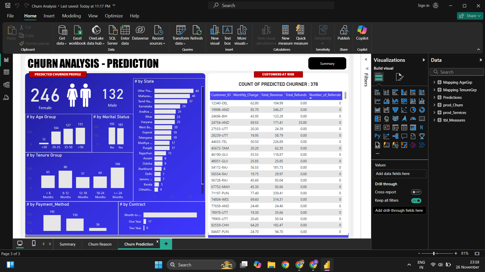

# Customer Churn Analysis and Prediction

## 📋 Overview
This project aims to analyze customer churn patterns and predict potential churners using a comprehensive **ETL Process**, **Power BI Dashboards**, and **Machine Learning Models**. It provides actionable insights to help organizations retain customers and design effective marketing campaigns.

---

## 🎯 Objectives
- Visualize and analyze customer data at **Demographic**, **Geographic**, **Payment & Account Info**, and **Service** levels.
- Study churner profiles and identify areas for implementing marketing campaigns.
- Develop a predictive model to identify potential future churners.

---

## 🚀 Features
1. **ETL Process in SQL Server:**
   - Created and managed a database in **SQL Server** to handle recurring data loads.
   - Imported CSV data into staging tables using the **Import Wizard**.
   - Transformed data using SQL queries to prepare for analysis.

2. **Interactive Power BI Dashboards:**
   - Visualized customer data, including churn metrics, demographic trends, and service usage.
   - Key Metrics:
     - **Total Customers**
     - **Total Churn & Churn Rate**
     - **New Joiners**
   - Segmentation:
     - **Churn Status**: Based on customer status.
     - **Monthly Charge Range**, **Age Groups**, and **Tenure Groups**.
   - Insights:
     - Top demographic and geographic churn patterns.
     - Service utilization impact on churn.

3. **Churn Prediction with Machine Learning:**
   - Implemented a **Random Forest Classifier** using **Python** to predict potential churners.
   - Utilized SQL Server data exports for model training.
   - Enhanced prediction accuracy with data preprocessing and feature engineering.

4. **Power BI Visualization of Predictions:**
   - Imported predicted churn data into Power BI for further analysis.
   - Created comprehensive visualizations for predicted churn metrics.

---
## 💡 Insights and Takeaways

1. **Churn Drivers**
- Customers with **shorter tenures** and **higher monthly charges** are more likely to churn.
- Certain **services** and **payment methods** show higher churn rates.

2. **Customer Retention Strategies**
- Focus **marketing campaigns** on high-churn demographics and geographic areas.
- Introduce **loyalty programs** for long-term customers and **discounts** for high-charge segments.

3. **Predictive Modeling Accuracy**
- The **Random Forest Classifier** achieved **high accuracy** by considering **demographic** and **service-related features**.

## 🔧 Tools and Technologies
- **Excel**: Dataset preparation.
- **SQL**: For data extraction and transformation.
- **Power BI**: For creating interactive visualizations and dashboards.
- **Python**: Libraries used include Pandas, NumPy, Matplotlib, and scikit-learn.

## 📊 Power BI Dashboard Highlights

1. **Summary Dashboard**
- **Total Customers**, **Churn Rate**, **New Joiners**.
- Insights into **gender**, **age**, **tenure**, and **geographic distribution**.
- Summary Dashboard

2. **Churn Insights**
- Top churn categories and reasons.
- Churn rate based on services used.

3. **Predicted Churn Analysis**
- Demographic and account insights for predicted churners.
- Key attributes influencing churn.
- Predicted Churn Analysis
 

---

## 🧠 Machine Learning Workflow

1. **Data Preparation**
- Data loaded from **SQL Server views**.
- Cleaned and preprocessed in **Python** for model training.

2. **Model Training**
- Implemented a **Random Forest Classifier** for binary classification.

3. **Evaluation**
- Tested the model for **accuracy**, **precision**, and **recall**.

4. **Prediction**
- Predicted churners were visualized in **Power BI**.

---

## 📈 Key Metrics
- **Total Customers**: Count of all customers.
- **Total Churn**: Sum of churned customers.
- **Churn Rate**: Percentage of customers who churned.
- **New Joiners**: Recently added customers.

---

## 🌟 Results
- Developed a **Power BI Dashboard** for actionable insights into churn patterns.
- Created a churn prediction model with **high accuracy** to identify at-risk customers.
- Identified churn drivers to help design effective **retention strategies**.

---

## 🤝 Let's Connect!

I am always excited to discuss my projects and learn more about new opportunities. Feel free to reach out!

- **Email**: [ashishranjan5323@gmail.com](mailto:ashishranjan5323@gmail.com)  
- **LinkedIn**: [Ashish Ranjan](https://www.linkedin.com/in/ashish-ranjan-4a3799266/)  
- **GitHub**: [Ashishranjan007](https://github.com/Ashishranjan007)
